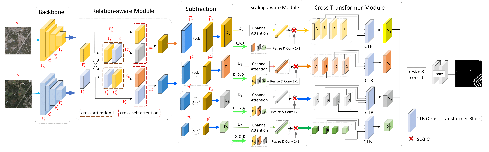
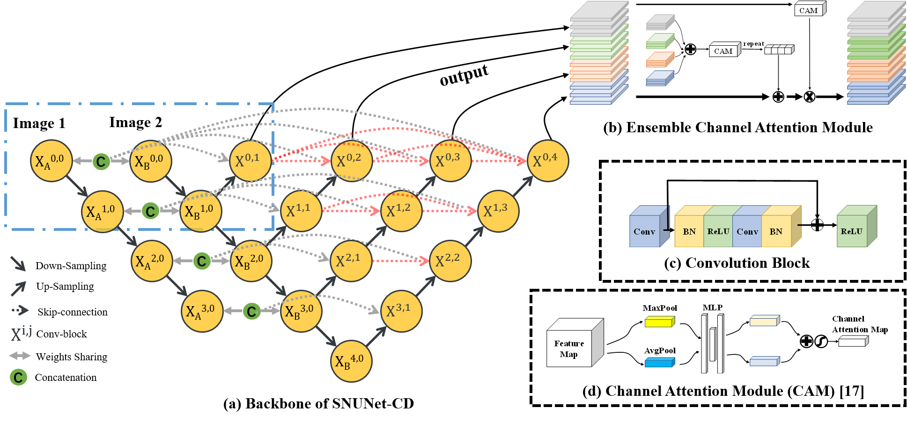

# SarasNET

# SNUNet

# Change_Detection Fellowship Keystone Project:

### Summary

Implemented a pre-trained Siamese Network using Convolutional Neural Networks, Attention mechanism, Transformers and more, called "[SarasNET](https://github.com/f64051041/SARAS-Net)" to apply on satellite imagery data to develop a change detection (CD) model. The SarasNET is fine-tuned on different datasets such as CDD dataset to output relevant change masks. The NestedUNET folder contains code that works on the "[CDD dataset](https://drive.google.com/file/d/1GX656JqqOyBi_Ef0w65kDGVto-nHrNs9/edit)" which the SarasNET is first fine-tuned on, enabling comparison of results and potential exploration of this direction.

Additionally, this repo contains code for a "[custom SiameseNET](https://arxiv.org/abs/1810.09111)"called CosimNET, originally used for scene detection and is trained from scratch to give an F1-score of 0.52 only with 100 epochs. This custom siamese network trained with only a single convolutional layer unlike in the paper is able to locate building changes adequately - demonstrating the discriminative capabilities and effectiveness of the approach.

Lastly, the last model is a simple Siamese Network which outputs a simalarity score given two bi-temporal images which is trained on a "[hurricane building damage dataset](https://ieee-dataport.org/open-access/detecting-damaged-buildings-post-hurricane-satellite-imagery-based-customized)" where there are no available ground truth masks and the labels at hand are only damaged and undamaged post hurricance.

These models can be helpful in monitoring damage from natural disasters given satellite imagery or be used to detect unauthorized structures (people living in trailers, camping etc) relating to land-use and land-cover change detection (LULC) for the Hawaii Land Trust, HILT.

All these three approaches can be a direction to work towards by the next cohort via feature extraction of the existing models, whereby implementing UAVs in remote sensing such as LULC CD has been well documented by [Osco et al. (2021)](https://arxiv.org/pdf/2101.10861.pdf). For the advantages and pitfalls of practical deployment of UAVs such as the ideal resolution-size for waste detection with unsupervised learning [Youme et al. (2021)](https://reader.elsevier.com/reader/sd/pii/S1877050921011224?token=14CBFD15842FF7B7DC57A4325A6591E905A3DDA92DC951D256BC8559968F6614799323CA5EAA1DD95684DDBCD3E012D0&originRegion=eu-west-1&originCreation=20230330180017) give important guidance for LULC CD. For feature extraction for the use-case of Hawaii, the TU Munich maintaining the [DynamicEarthNet](https://mediatum.ub.tum.de/1650201?id=1650201&change_language=en) database recommends to use planet20N's (Carribean area) observations for computer vision as "climate conditions, latitude and land cover types will be pretty similar". Moreover, the [DynamicEarthNet model](https://arxiv.org/abs/2203.12560) could prove useful in future CD approaches for HILT.

## Datasets

- [Levir-CD Dataset](https://justchenhao.github.io/LEVIR/)
- [CDD Change Detection Dataset](https://drive.google.com/file/d/1GX656JqqOyBi_Ef0w65kDGVto-nHrNs9/edit) 
- [IEEE Detecting Damaged Buildings Dataset](https://ieee-dataport.org/open-access/detecting-damaged-buildings-post-hurricane-satellite-imagery-based-customized)
- [DynamicEarthNet: Daily Multi-Spectral Satellite Dataset for Semantic Change Segmentation](https://mediatum.ub.tum.de/1650201?id=1650201&change_language=en)

## Relevant papers:
  - [Scale and Relation Aware Siamese Network for Change Detection](https://arxiv.org/abs/2212.01287)
  - [Learning to Measure Change: Fully Convolutional Siamese Metric Networks for Scene Change Detection](https://arxiv.org/abs/1810.09111)
  - [Change detection in remote sensing images using conditional adversarial networks](https://www.int-arch-photogramm-remote-sens-spatial-inf-sci.net/XLII-2/565/2018/isprs-archives-XLII-2-565-2018.pdf)
  - [A review of deep learning in remote sensing](https://arxiv.org/pdf/2101.10861.pdf)
  - [Deep Learning and Remote Sensing: Detection of Dumping
Waste Using UAV](https://reader.elsevier.com/reader/sd/pii/S1877050921011224?token=14CBFD15842FF7B7DC57A4325A6591E905A3DDA92DC951D256BC8559968F6614799323CA5EAA1DD95684DDBCD3E012D0&originRegion=eu-west-1&originCreation=20230330180017)
- [DynamicEarthNet: Daily Multi-Spectral Satellite Dataset for Semantic Change Segmentation](https://arxiv.org/abs/2203.12560)

